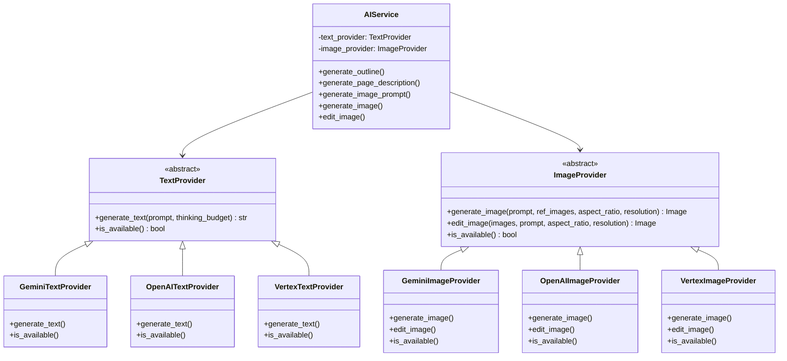

# Banana-Slides Architecture

This document provides an overview of the banana-slides system architecture, explaining how components interact and data flows through the application.

## Table of Contents

- [System Overview](#system-overview)
- [Tech Stack](#tech-stack)
- [High-Level Architecture](#high-level-architecture)
- [Request Flow](#request-flow)
- [AI Provider Architecture](#ai-provider-architecture)
- [Async Task Processing](#async-task-processing)
- [File Storage Structure](#file-storage-structure)

---

## System Overview

Banana-slides is an AI-powered presentation generation application built on a modern web stack. It uses the Gemini AI model (via the "nano banana pro" image generation capabilities) to create visually appealing PPT slides from user ideas, outlines, or descriptions.

The application follows a client-server architecture with a React frontend communicating with a Flask backend via REST APIs.

---

## Tech Stack

### Frontend

| Technology | Purpose |
|------------|---------|
| React 18 | UI framework |
| TypeScript | Type safety |
| Vite 5 | Build tool |
| Zustand | State management |
| React Router v6 | Routing |
| Tailwind CSS | Styling |
| @dnd-kit | Drag and drop functionality |
| Axios | HTTP client |
| Lucide React | Icons |

### Backend

| Technology | Purpose |
|------------|---------|
| Python 3.10+ | Runtime |
| Flask 3.0 | Web framework |
| SQLAlchemy | ORM |
| SQLite | Database |
| uv | Package manager |
| python-pptx | PPTX generation |
| Pillow | Image processing |
| ThreadPoolExecutor | Concurrent task execution |
| Flask-CORS | Cross-origin support |

### AI Services

| Provider | Usage |
|----------|-------|
| Google Gemini | Text generation & image generation |
| OpenAI (compatible) | Alternative text/image provider |
| Vertex AI | GCP-hosted Gemini alternative |

---

## High-Level Architecture


---

## Request Flow

### Example: Generate PPT from Idea

This diagram shows how a PPT generation request flows through the system:


---

## AI Provider Architecture

The backend supports multiple AI providers through a pluggable architecture:



**Provider Selection:**

The provider is selected based on the `AI_PROVIDER_FORMAT` environment variable:
- `gemini` - Uses Google GenAI SDK (default)
- `openai` - Uses OpenAI-compatible API
- `vertex` - Uses Google Vertex AI

---

## Async Task Processing

Long-running operations (image generation, batch descriptions) are handled asynchronously:


**Task Types:**
- `GENERATE_DESCRIPTIONS` - Batch generate page descriptions
- `GENERATE_IMAGES` - Batch generate page images
- `GENERATE_PAGE_IMAGE` - Single page image generation
- `EDIT_PAGE_IMAGE` - Image editing/inpainting
- `GENERATE_MATERIAL_IMAGE` - Material generation
- `EXPORT_EDITABLE_PPTX` - Editable PPTX export

---

## File Storage Structure

```
banana-slides/
├── uploads/                      # Uploaded files root
│   ├── {project_id}/             # Project-specific files
│   │   ├── template/             # Template images
│   │   │   └── template.png
│   │   ├── pages/                # Generated page images
│   │   │   ├── page_0.png
│   │   │   └── page_1.png
│   │   ├── materials/            # Material images
│   │   │   └── material_abc.png
│   │   └── reference_files/      # Uploaded reference docs
│   │       └── document.pdf
│   └── mineru/                   # MinerU parsed files
│       └── {extract_id}/
│           ├── content.json
│           └── images/
├── backend/
│   ├── instance/
│   │   └── database.db           # SQLite database
│   └── exports/                  # Generated exports
│       └── {project_id}/
│           ├── slides.pptx
│           └── slides.pdf
```

---

## Key Design Decisions

1. **SQLite + WAL Mode**: Chosen for simplicity and single-file deployment. WAL mode enables concurrent reads/writes required for async task processing.

2. **ThreadPoolExecutor over Celery**: Simpler deployment without Redis/message queue. Suitable for moderate concurrency.

3. **Pluggable AI Providers**: Enables switching between Gemini, OpenAI, or Vertex with minimal code changes.

4. **JSON in Text Columns**: Page outline/description stored as JSON strings for flexibility, with helper methods for serialization.

5. **Image Versioning**: Each page maintains version history for undo/redo functionality.

6. **Zustand over Redux**: Simpler state management with less boilerplate, suitable for this application's complexity.
