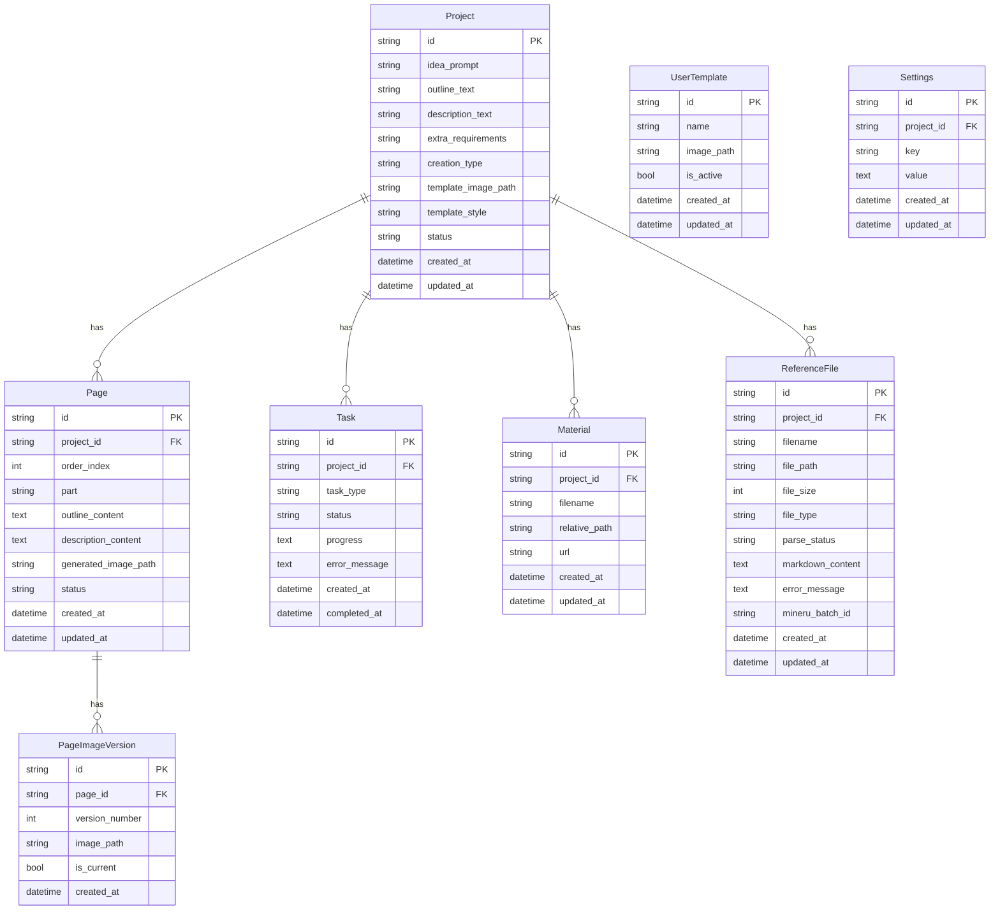
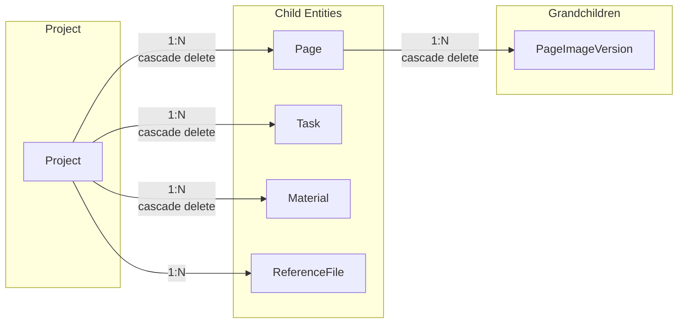

# Data Models

This document describes the database schema and relationships for banana-slides.

## Table of Contents

- [Entity Relationship Diagram](#entity-relationship-diagram)
- [Models Overview](#models-overview)
- [Model Details](#model-details)
  - [Project](#project)
  - [Page](#page)
  - [Task](#task)
  - [Material](#material)
  - [ReferenceFile](#referencefile)
  - [UserTemplate](#usertemplate)
  - [PageImageVersion](#pageimageversion)
  - [Settings](#settings)
- [Relationships](#relationships)

---

## Entity Relationship Diagram



---

## Models Overview

| Model | Purpose | Key Fields |
|-------|---------|------------|
| **Project** | PPT project container | `idea_prompt`, `creation_type`, `status` |
| **Page** | Individual slide | `outline_content`, `description_content`, `generated_image_path` |
| **Task** | Async operation tracker | `task_type`, `status`, `progress` |
| **Material** | Material images | `filename`, `url` |
| **ReferenceFile** | Uploaded reference docs | `markdown_content`, `parse_status` |
| **UserTemplate** | PPT templates | `image_path`, `is_active` |
| **PageImageVersion** | Image history | `version_number`, `is_current` |
| **Settings** | App configuration | `key`, `value` |

---

## Model Details

### Project

The main container for a PPT generation project.

**File:** `backend/models/project.py`

| Field | Type | Description |
|-------|------|-------------|
| `id` | String(36) | UUID primary key |
| `idea_prompt` | Text | User's idea input (for "idea" creation type) |
| `outline_text` | Text | User's outline input (for "outline" creation type) |
| `description_text` | Text | User's description input (for "descriptions" creation type) |
| `extra_requirements` | Text | Additional requirements applied to every page prompt |
| `creation_type` | String(20) | One of: `idea`, `outline`, `descriptions` |
| `template_image_path` | String(500) | Path to template image file |
| `template_style` | Text | Style description (for no-template mode) |
| `status` | String(50) | Project status: `DRAFT`, `GENERATING`, `COMPLETED` |
| `created_at` | DateTime | Creation timestamp |
| `updated_at` | DateTime | Last update timestamp |

**Creation Types:**
- `idea` - User provides a simple idea, AI generates outline and descriptions
- `outline` - User provides an outline, AI generates descriptions
- `descriptions` - User provides full descriptions, only image generation needed

---

### Page

Represents a single slide in the presentation.

**File:** `backend/models/page.py`

| Field | Type | Description |
|-------|------|-------------|
| `id` | String(36) | UUID primary key |
| `project_id` | String(36) | Foreign key to Project |
| `order_index` | Integer | Position in presentation (0-based) |
| `part` | String(200) | Optional section name |
| `outline_content` | Text | JSON: `{title, points}` |
| `description_content` | Text | JSON: `{title, text_content, layout_suggestion}` |
| `generated_image_path` | String(500) | Path to generated slide image |
| `status` | String(50) | `DRAFT`, `GENERATING`, `GENERATED`, `FAILED` |
| `created_at` | DateTime | Creation timestamp |
| `updated_at` | DateTime | Last update timestamp |

**Outline Content Structure:**
```json
{
  "title": "Slide Title",
  "points": ["Point 1", "Point 2", "Point 3"]
}
```

**Description Content Structure:**
```json
{
  "title": "Slide Title",
  "text_content": ["Paragraph 1", "Paragraph 2"],
  "layout_suggestion": "Two-column layout with image on left"
}
```

---

### Task

Tracks asynchronous operations like batch image generation.

**File:** `backend/models/task.py`

| Field | Type | Description |
|-------|------|-------------|
| `id` | String(36) | UUID primary key |
| `project_id` | String(36) | Foreign key to Project |
| `task_type` | String(50) | Type of task (see below) |
| `status` | String(50) | `PENDING`, `RUNNING`, `COMPLETED`, `FAILED` |
| `progress` | Text | JSON: `{total, completed, failed}` |
| `error_message` | Text | Error details if failed |
| `created_at` | DateTime | Creation timestamp |
| `completed_at` | DateTime | Completion timestamp |

**Task Types:**
| Type | Description |
|------|-------------|
| `GENERATE_DESCRIPTIONS` | Batch generate page descriptions |
| `GENERATE_IMAGES` | Batch generate page images |
| `GENERATE_PAGE_IMAGE` | Single page image generation |
| `EDIT_PAGE_IMAGE` | Image editing |
| `GENERATE_MATERIAL_IMAGE` | Material generation |
| `EXPORT_EDITABLE_PPTX` | Editable PPTX export |

---

### Material

Stores material images for use in slide generation.

**File:** `backend/models/material.py`

| Field | Type | Description |
|-------|------|-------------|
| `id` | String(36) | UUID primary key |
| `project_id` | String(36) | Foreign key to Project (nullable for global materials) |
| `filename` | String(500) | Original filename |
| `relative_path` | String(500) | Path relative to uploads folder |
| `url` | String(500) | Frontend-accessible URL |
| `created_at` | DateTime | Creation timestamp |
| `updated_at` | DateTime | Last update timestamp |

---

### ReferenceFile

Stores uploaded reference documents and their parsed content.

**File:** `backend/models/reference_file.py`

| Field | Type | Description |
|-------|------|-------------|
| `id` | String(36) | UUID primary key |
| `project_id` | String(36) | Foreign key to Project (nullable) |
| `filename` | String(500) | Original filename |
| `file_path` | String(500) | Path relative to uploads folder |
| `file_size` | Integer | File size in bytes |
| `file_type` | String(50) | Extension: `pdf`, `docx`, `pptx`, etc. |
| `parse_status` | String(50) | `pending`, `parsing`, `completed`, `failed` |
| `markdown_content` | Text | Parsed markdown content |
| `error_message` | Text | Error message if parsing failed |
| `mineru_batch_id` | String(100) | MinerU service batch ID |
| `created_at` | DateTime | Creation timestamp |
| `updated_at` | DateTime | Last update timestamp |

**Supported File Types:** `pdf`, `docx`, `pptx`, `doc`, `ppt`, `xlsx`, `xls`, `csv`, `txt`, `md`

---

### UserTemplate

User-defined PPT templates.

**File:** `backend/models/user_template.py`

| Field | Type | Description |
|-------|------|-------------|
| `id` | String(36) | UUID primary key |
| `name` | String(200) | Template name |
| `image_path` | String(500) | Path to template image |
| `is_active` | Boolean | Whether template is currently active |
| `created_at` | DateTime | Creation timestamp |
| `updated_at` | DateTime | Last update timestamp |

---

### PageImageVersion

Maintains version history for page images.

**File:** `backend/models/page_image_version.py`

| Field | Type | Description |
|-------|------|-------------|
| `id` | String(36) | UUID primary key |
| `page_id` | String(36) | Foreign key to Page |
| `version_number` | Integer | Version number (auto-incrementing per page) |
| `image_path` | String(500) | Path to image file |
| `is_current` | Boolean | Whether this is the active version |
| `created_at` | DateTime | Creation timestamp |

---

### Settings

Stores application settings.

**File:** `backend/models/settings.py`

| Field | Type | Description |
|-------|------|-------------|
| `id` | String(36) | UUID primary key |
| `project_id` | String(36) | Foreign key to Project (nullable for global settings) |
| `key` | String(100) | Setting key |
| `value` | Text | Setting value (JSON for complex values) |
| `created_at` | DateTime | Creation timestamp |
| `updated_at` | DateTime | Last update timestamp |

---

## Relationships



**Cascade Behavior:**
- Deleting a Project automatically deletes all related Pages, Tasks, and Materials
- Deleting a Page automatically deletes all related PageImageVersions
- ReferenceFiles are not cascade-deleted (can be reused across projects)

**Loading Strategy:**
All relationships use `lazy='select'` for flexible loading. Pages are ordered by `order_by='Page.order_index'`.
